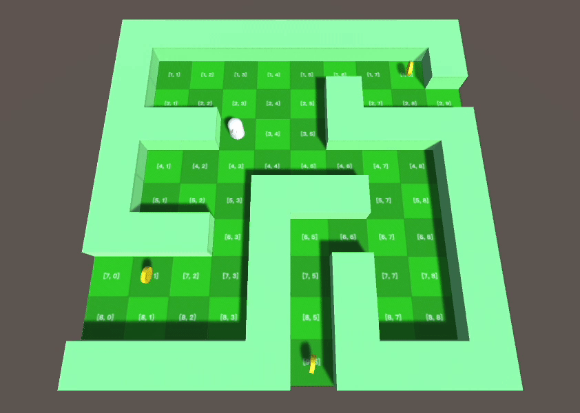
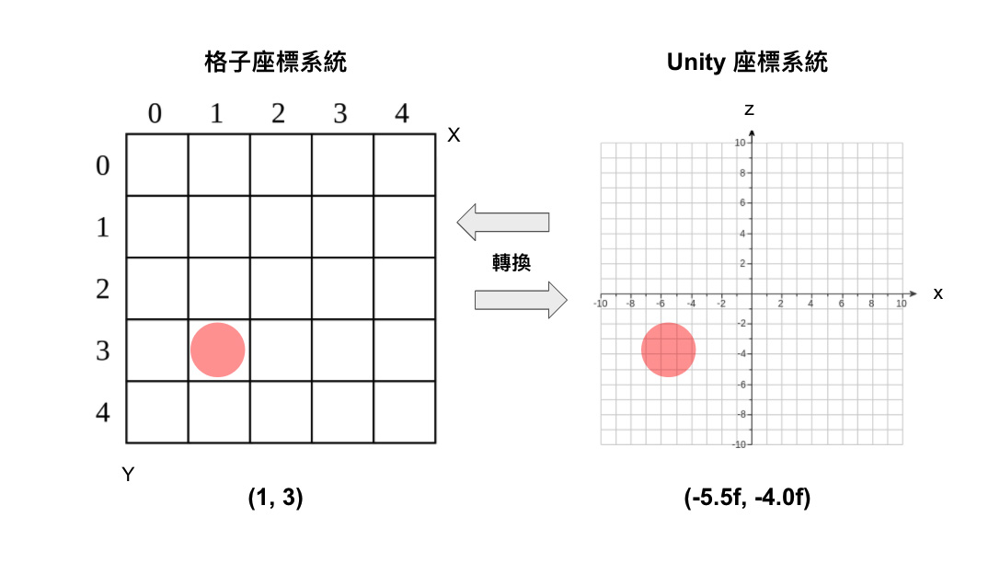
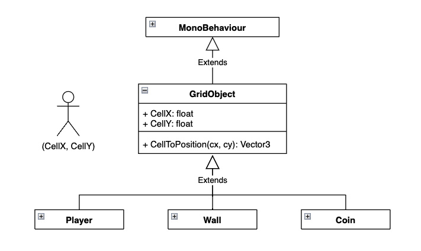

# Unity 格狀遊戲系統範例 


此為教學範例，採用最基本的物件組成。主要示範格狀系統的位移轉換、地圖架構。
 


<br/>

## 地圖資料結構
使用二維陣列當作地圖資訊，以數字代表該格內容（例如：0 = 路；1 = 牆）：
```C#
int[,] Map = new int[10, 10] {
    { 1, 1, 1, 1, 1, 1, 1, 1, 1, 1 },
    { 1, 0, 0, 0, 0, 0, 0, 0, 0, 1 },
    { 1, 0, 0, 0, 0, 0, 1, 0, 0, 0 },
    { 1, 1, 1, 0, 0, 0, 1, 1, 1, 1 },
    { 1, 0, 0, 0, 0, 0, 0, 0, 0, 1 },
    { 1, 0, 0, 0, 1, 1, 1, 0, 0, 1 },
    { 1, 1, 1, 0, 1, 0, 0, 0, 0, 1 },
    { 0, 0, 0, 0, 1, 0, 1, 0, 0, 1 },
    { 0, 0, 0, 0, 1, 0, 1, 0, 0, 1 },
    { 1, 1, 1, 1, 1, 0, 1, 1, 1, 1 }
};
```

使用兩個 for 迴圈即可逐格查詢整張地圖內容：
(注意，因爲執行順序的關係，第一層迴圈掌管的是 Y 座標，第二層才是 X 座標)

```C#
for (int y = 0; y < 10; y++)
{
    for (int x = 0; x < 10; x++)
    {
        // 取得格子內編號
        int cellVal = Map[y, x];

        // 1 = 牆壁
        if (cellVal == 1)
        {
            // 產生牆壁元件，放到該座標位置上
        }

        // ......
    }
}
```
<br/>

## 移動前檢查地圖格子
玩家移動由 SceneController 指派，在每次移動某一方向時，都先檢查將要去的格子，數值是否為 0（可走的路）。
```C#
void Update() {

    // 按下左方向鍵
    if (Input.GetKeyDown(KeyCode.LeftArrow))
    {
        // 確認玩家往左一格還在陣列之內
        if (player.CellX - 1 >= 0) 
        {
            // 取得將要前往的左一格數值
            int cellVal = Map[player.CellY, player.CellX - 1];

            // 判斷是路才走過去
            if (cellVal == 0)
            {
                player.CellX -= 1;
            }
        }
    }

    // 其他方向鍵，都是類似做法
    // ......
}
```

<br/>

## 座標系統轉換
格狀遊戲會自定義一個座標系統，所有物件都是以此來安排位置、計算阻擋。但呈現畫面時，還是得轉換為遊戲引擎(Unity)的位置座標。


格子(Cell)座標轉換到 Unity 座標的方法： 
```C#
float WorldOffsetX = -45;
float WorldOffsetY = 45;
float WorldRatio = 10;

Vector3 CellToPosition(int cx, int cy)
{
    float realX = WorldOffsetX + cx * WorldRatio; // 中心偏移X + X座標 * 放大比例
    float realZ = WorldOffsetY - cy * WorldRatio; // 中心偏移Y - Y座標 * 放大比例

    return new Vector3(realX, 0, realZ);
}
```
<br/>

## 格子物件基礎類別 (GridObject)
由於在格子地圖上的物件，大多都需要用到格子座標(CellX, CellY)、座標轉換公式等，所以先將這些必須的基礎功能整合為一個 GridObject 類別，其他元件都繼承它，以此為基礎再添加各自的特別功能，這樣新增和維護都方便。



<br/>


